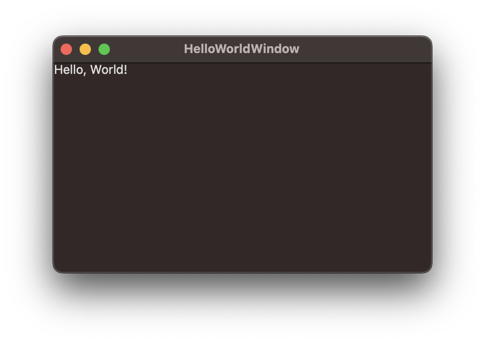

# PyApplicationFramework

## Introduction
The PyApplicationFramework is a set of library wrappers related to application development in Python.
This framework allows developers to write a GUI application more simply, with a programming paradigm similar to SwiftUI.
The declarative syntax of User Interface markup, inspired by SwiftUI, is one of the critical functionalities in this project.

## A Basic "Hello, World!" Code with Explanation
```python
import wx

class HelloWorldFrame(wx.Frame):
    def __init__(self, parent):
        wx.Frame.__init__(self, parent)
        self.SetTitle("HelloWorldWindow")
        panel = wx.Panel(self)
        sizer = wx.BoxSizer(wx.VERTICAL)
        text = wx.StaticText(panel, label="Hello, World!")
        sizer.Add(text)
        panel.SetSizer(sizer)

if __name__ == "__main__":
    app = wx.App()
    frame = HelloWorldFrame(None)
    frame.Show()
    app.MainLoop()
```
The code above creates a simple window with an text "Hello, World!" at the top-left corner of it as shown as the image below:


The code below written with PyApplicationFramework is a code which shows the same result:
```python
import wx
from pyappframework.ui import Window
from pyappframework.ui.controls import Panel, StaticText

class HelloWorldWindow(Window):
    def __init__(self, *args, **kw):
        super().__init__(*args, **kw)
        self.SetTitle("HelloWorldWindow")

    def body(self) -> Panel:
        return (
            Panel(wx.BoxSizer(wx.VERTICAL))
                .body [[
                StaticText(label="Hello, World!")
            ]]
        )

if __name__ == "__main__":
    app = wx.App()
    frame = HelloWorldWindow()
    frame.Show()
    app.MainLoop()
```

As you can see, you can recognize the hierarchical structures of the UI, without using external markup language (like [XRC](https://docs.wxpython.org/wx.xrc.1moduleindex.html)), which is still needed to instantiate every single control defined inside of it.

## Mutable Expressions
A mutable variable can trigger events when its value changes.
A mutable expression can consist of one or more regular variables or expressions and a mutable variable or expression, and fires an event whenever the value of the mutable variable included in the expression changes.

```python
import wx
import pyappframework as pyaf
from pyappframework import ui
from pyappframework.ui import controls as ctl

class MutableWindow(ui.Window):
    def __init__(self, *args, **kw):
        self.textbox_value = pyaf.Mutable[str]("Initial value")
        super().__init__(*args, **kw)
        self.SetTitle("MutableWindow")

    def body(self) -> ctl.Panel:
        return (
            ctl.ScrollablePanel(wx.BoxSizer(wx.VERTICAL))
            .body [[
                ctl.StaticText(label=self.textbox_value)
                    .sizer(wx.SizerFlags().Border(wx.TOP | wx.LEFT)),
                ctl.StaticText(label=self.textbox_value + "-with suffix")
                    .sizer(wx.SizerFlags().Border(wx.TOP | wx.LEFT)),
                ctl.TextCtrl(value=self.textbox_value)
                    .sizer(proportion=0, flag=wx.EXPAND),
                ctl.SearchCtrl(value=self.textbox_value)
                    .sizer(proportion=0, flag=wx.EXPAND),
            ]]
        )

if __name__ == "__main__":
    app = wx.App()
    frame = MutableWindow()
    frame.Show()
    app.MainLoop()
```


## Default Controls
- Button
- CheckBox
- Choice
- CollapsiblePanel
- Control
- DataViewCtrl
- Gauge
- InfoBar
- ListBox
- Notebook
- Panel
- Plot
- ScrollablePanel
- SearchCtrl
- SplitterWindow
- StaticBitmap
- StaticBox
- StaticLine
- StaticText
- TextCtrl
- ToolBar
- TreeCtrl
- WebView

## Controls with Additional Requirements
- GLCanvas (PyOpenGL)
- Plot (matplotlib)
